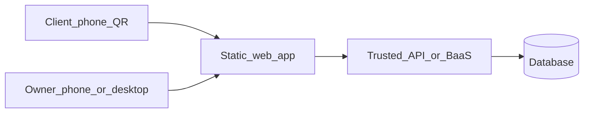

# Architecture

**Context:** Mobile-first **web** app: **public QR landing** + **password admin** + **aggregate event totals**. Clients have **no accounts**. Owner edits must work **cross-device**.

## Recommended stack *(defaults—adjust only if constrained)*

| Layer | Recommendation |
|-------|----------------|
| Tooling | **Vite** |
| UI | **React + TypeScript** |
| Styling | **Tailwind CSS** |
| Routing | **React Router** |
| Data / auth | **Supabase** *(recommended)*: Postgres + row-level security, or **serverless API + Postgres** |
| Hosting | **Vercel / Netlify / Cloudflare Pages** for static frontend; colocate serverless if used |

**Why not “static only”:** publishing shared content, password verification, and reliable **aggregate** event counts typically requires **trusted** server logic or a BaaS.

## Diagram



## Folder structure *(recommended)*

```
/docs
/public
/src
  /components
  /pages
  /hooks
  /lib
  /types
  main.tsx
package.json
```

## State

- **Server state:** TanStack Query *(recommended)* or lightweight fetch hooks.
- **UI state:** React local state.

## Persistence

- **Content:** single published record (or versioned rows) keyed to owner/workspace.
- **Events:** append-only rows: `page_view`, `primary_action_complete` with timestamps; aggregate in queries.

## Offline

- MVP: optimize **online** speed (per PRD). Optional caching headers for static assets; PWA optional Phase 2.

## Security

- Never store plaintext owner passwords; rate-limit admin attempts and event writes at least naïvely.
- If primary action collects PII, encrypt in transit, minimize retention, document in UI.

## Accessibility

- See [DESIGN_SYSTEM.md](./DESIGN_SYSTEM.md).

---

*Recommendations only unless locked in build prompt.*
